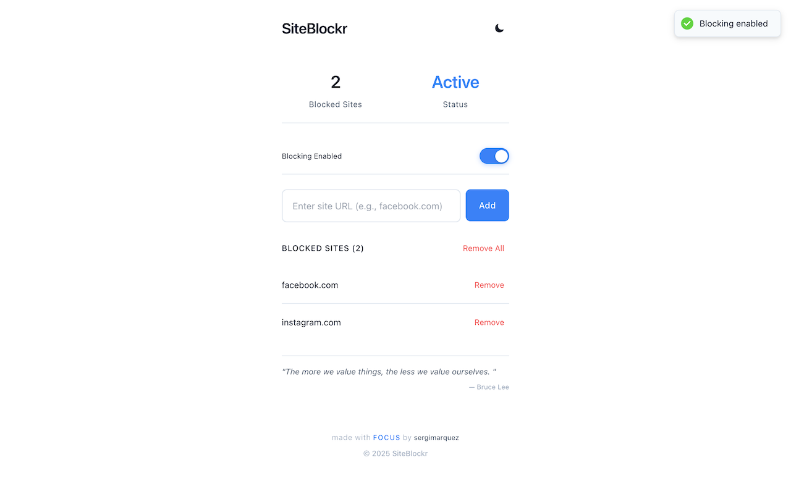
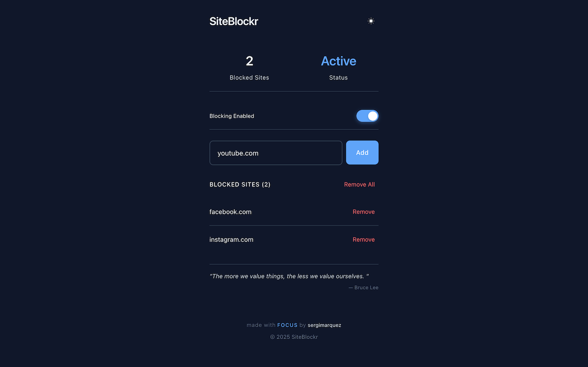

# 🚫 SiteBlockr

<div align="center">
  
  
  **Chrome extension for blocking distracting websites and improving productivity**
  

  
</div>

---

## 🛠️ Tech Stack

- **Manifest V3** - Latest Chrome extension API
- **TypeScript** - Type-safe development
- **React** - Component-based UI
- **Tailwind CSS** - Utility-first styling
- **Chrome APIs** - declarativeNetRequest, storage

## ✨ Features

- Website blocking with real-time rule management
- Toggle control for instant enable/disable
- Dark/light theme switching
- Motivational quotes integration
- Local data storage (privacy-focused)
- Clean, responsive UI

## 📸 Screenshots


*Clean and intuitive options interface*


*Dashboard with blocking controls and theme toggle*

## 🚀 Installation

### Development Setup
```bash
# Clone and install dependencies
git clone https://github.com/sergimarquez/site-blockr.git
cd site-blockr
npm install
cd options && npm install && cd ..

# Build extension
npm run build:all

# Load in Chrome
# chrome://extensions/ → Developer mode → Load unpacked → Select dist/
```

### Chrome Web Store
[Install from Chrome Web Store](https://chromewebstore.google.com/detail/ogicdnegacclceajhgaoehlnidgndllp)

## 🏗️ Project Structure

```
site-blockr/
├── manifest.json          # Extension manifest (Manifest V3)
├── background.ts          # Service worker with declarativeNetRequest
├── options/              # React-based options page
│   ├── src/App.tsx       # Main React component
│   └── tailwind.config.js # Tailwind configuration
└── dist/                # Built extension files
```

## 🔧 Key Implementation Details

- **Background Script**: Uses Chrome's declarativeNetRequest API for efficient URL blocking
- **React Integration**: Modern component architecture with TypeScript
- **Storage Management**: Chrome storage API with error handling and retry logic
- **Theme System**: CSS variables with localStorage persistence
- **Build Pipeline**: Automated TypeScript compilation and React bundling

## 📱 Usage

1. Add websites to block list
2. Toggle blocking on/off as needed
3. Switch between dark/light themes

## 🔒 Privacy

- All data stored locally using Chrome storage API
- No external data transmission
- No analytics or tracking
- Open source for transparency

---

**Built by [Sergi Marquez](https://sergimarquez.com)** • [View Privacy Policy](https://sergimarquez.github.io/site-blockr/privacy-policy.html) 